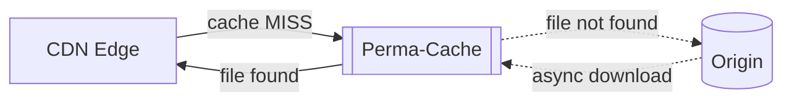

Perma-Cache is a secondary permanent cache layer that sits between the CDN and your origin. When a cache MISS occurs on the CDN, the system first checks if the file exists in your geo-replicated storage before fetching from your origin.

Due to the optimized routing and global footprint of Bunny's geo-replicated storage, this provides a significant performance boost for uncached content and reduces traffic to your origin. Instead of going from the CDN to your server every time, there's a high chance the file is already available right next to the CDN nodes on globally replicated storage.

## How it works



1. When a cache MISS happens on the CDN, the request is first sent to the Perma-Cache storage
2. If the file exists in storage, it's returned to the CDN immediately. Your origin is never contacted.
3. If the file doesn't exist, the request passes through to your origin. The file is then asynchronously downloaded to Perma-Cache storage in the background

The next time any CDN node requests this file as part of a cache MISS, it will already be available on the storage node. The file is effectively permanently stored in the system.

<Note>
  Perma-Cache connects to any Edge Storage zone and uses a special folder
  structure. See [Perma-Cache Folder
  Structure](/docs/cdn/perma-cache-folder-structure) for details.
</Note>

## Enable Perma-Cache

<Steps>
  <Step title="Create a Storage Zone">
    Go to **Storage** and create a new Storage Zone. Enable geo-replication if you want files distributed across multiple regions.
  </Step>
  <Step title="Open your Pull Zone settings">
    Go to **CDN** > **Pull Zones** and select your zone.
  </Step>
  <Step title="Connect the Storage Zone">
    Click **Caching**, select **Perma-Cache**, and choose your Storage Zone from the dropdown.
  </Step>
  <Step title="Save configuration">
    Click **Save Configuration**. Perma-Cache will begin filling as cache MISSes occur.
  </Step>
</Steps>

<Info>
  If you initially see a very small number of cached files, that just means the
  CDN is already doing a great job keeping its own cached files. Perma-Cache
  only fills on cache MISSes.
</Info>

## Cache headers

The CDN returns two headers that indicate where content was served from:

### CDN-Cache header

| Value  | Meaning                                                           |
| ------ | ----------------------------------------------------------------- |
| `HIT`  | Content was served from CDN edge cache                            |
| `MISS` | Content was not in edge cache, fetched from Perma-Cache or origin |

### Perma-Cache header

| Value  | Meaning                                     |
| ------ | ------------------------------------------- |
| `HIT`  | Content was served from Perma-Cache storage |
| `MISS` | Content was fetched from origin             |

### Header combinations

| CDN-Cache | Perma-Cache | What happened                                                                                                 |
| --------- | ----------- | ------------------------------------------------------------------------------------------------------------- |
| `MISS`    | `MISS`      | File not in CDN or Perma-Cache. Fetched from origin. Perma-Cache will store it in the background.             |
| `HIT`     | `MISS`      | File served from CDN edge cache. Perma-Cache status is cached, so it may show `MISS` until CDN cache expires. |
| `MISS`    | `HIT`       | File not in CDN edge cache but loaded from Perma-Cache.                                                       |
| `HIT`     | `HIT`       | File available in both CDN cache and Perma-Cache.                                                             |

<Note>
  The CDN aims to cache files as long as possible, but cache duration depends on
  available space at each PoP and how frequently the file is requested. Files
  with low request rates may be evicted sooner. Use Perma-Cache to ensure
  content is always served from Bunny infrastructure.
</Note>

## Cache purging behavior

Perma-Cache integrates with the file purging API:

- **Single URL purge:** The file is first deleted from Perma-Cache storage, then purged from the CDN. A fresh file is fetched from your origin on the next request.
- **Full Pull Zone purge:** Perma-Cache files are not deleted. Instead, the system switches to a new directory structure within the storage zone. You'll need to manually delete the old caching folder if needed.

<Warning>
  Wildcard purging and tag-based purging do not work when Perma-Cache is
  enabled.
</Warning>

## Important notes

<Warning>
  Don't use Perma-Cache as a substitute for permanent storage. A cache MISS on
  the CDN does not 100% guarantee that a file will appear in Perma-Cache. Always
  keep files on your origin. Purging the cache will cause Perma-Cache to
  re-fetch from the origin.
</Warning>

- **Origin Shield conflict:** You cannot use Perma-Cache and Origin Shield simultaneously. These features are mutually exclusive.
- **Storage-backed Pull Zones:** If your Pull Zone is directly connected to a Storage Zone as its origin, Perma-Cache is not available (you're already hosting content on Bunny storage).
- **Geo-replication:** If enabled on your Storage Zone, files are replicated across the global storage network for improved availability and performance.

## Folder structure

Perma-Cache uses a special directory structure within your storage zone to support cache vary settings and purging.

```
/__bcdn_perma_cache__/
  └── pullzone__<name>__<unique_id>/
      └── path/to/my/file/
          └── ___image.jpg___/
              └── ___file___
```

| Component                       | Description                                                                            |
| ------------------------------- | -------------------------------------------------------------------------------------- |
| `__bcdn_perma_cache__`          | Root folder used by all Pull Zones connected to this storage zone                      |
| `pullzone__<name>__<unique_id>` | Pull Zone folder. The `unique_id` increments on full zone purge                        |
| `path/to/my/file/`              | Normalized request path (multiple slashes combined into one)                           |
| `___image.jpg___/`              | File name enclosed in `___`                                                            |
| `___file___`                    | The actual cached file. If Vary settings are used, variations are stored as MD5 hashes |

**Full path example:**

```
/storage/__bcdn_perma_cache__/pullzone__mysite__20138242/assets/images/___logo.png___/___file___
```

When a full Pull Zone purge occurs, the `unique_id` increments and a new folder is used. Manually delete old folders to reclaim storage space.
